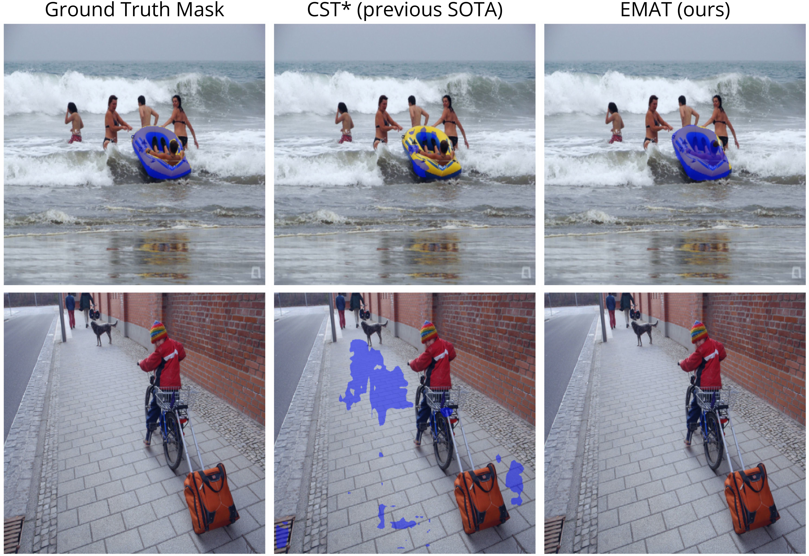

<div align="center">
<h1>Efficient Masked Attention Transformer for Few-Shot Classification and Segmentation</h1>

[**Dustin Carrión-Ojeda**](https://dustincarrion.github.io/)<sup>1,2</sup> &nbsp;&nbsp;&nbsp;
[**Stefan Roth**](https://www.visinf.tu-darmstadt.de/visual_inference/people_vi/stefan_roth.en.jsp)<sup>1,2</sup> &nbsp;&nbsp;&nbsp;
[**Simone Schaub-Meyer**](https://schaubsi.github.io/)<sup>1,2</sup>

<sup>1</sup>TU Darmstadt &nbsp;&nbsp;&nbsp;
<sup>2</sup>hessian.AI  
<h3>Accepted to GCPR 2025</h3>

[](https://arxiv.org/abs/2507.23642)
[](https://visinf.github.io/emat/)

[](https://opensource.org/licenses/Apache-2.0)
[](https://pytorch.org/)
[](https://lightning.ai/docs/pytorch/stable/)

<center>
    
</center>
</div>

**TL;DR:** EMAT processes high-resolution correlation tokens, boosting few-shot classification and segmentation, especially for small objects, while using at least four times fewer parameters than existing methods. 
It supports <i>N</i>-way <i>K</i>-shot tasks and correctly outputs empty masks when no target is present.


## Installation
This project was originally developed using Python 3.9, PyTorch 2.1.1, and CUDA 12.1 on Linux. To reproduce the environment, follow these steps:

```bash
# 1) Clone the repository
git clone https://github.com/visinf/emat

# 2) Move into the repository
cd emat

# 3) Create the conda environment
conda create -n emat -c conda-forge -c nvidia -c pytorch \
    python=3.9 cuda-version=12.1 \
    pytorch==2.1.1 torchvision==0.16.1 pytorch-cuda=12.1

# 4) Activate the conda environment
conda activate emat

# 5) Install additional required packages using pip
pip install -r requirements.txt
```

## Dataset Preparation
This project uses the [PASCAL-5<sup>i</sup>](https://arxiv.org/pdf/1709.03410) and [COCO-20<sup>i</sup>](https://arxiv.org/pdf/1909.13140) datasets. 
After downloading both datasets, organize them in the following directory structure:

```
<DIR_WITH_DATASETS>/
    PASCAL/
        JPEGImages/
        SegmentationClassAug/
        ...
    COCO/
        annotations/
        train2014/
        val2014/
        ...
```

## Training
EMAT can be trained for Few-Shot Classification and Segmentation (FS-CS) or Few-Shot Segmentation (FS-S). 
Below, we describe how to execute each type of few-shot task. 
We performed training on three NVIDIA RTX A6000 GPUs (48 GB). 
You can train EMAT using fewer GPUs by adjusting the batch size in the configuration file located in `configs/`.

### Prerequisites
1. The PASCAL-5<sup>i</sup> and COCO-20<sup>i</sup> datasets must be organized as described in the [Dataset Preparation](#dataset-preparation) section. Additionally, set the path `<DIR_WITH_DATASETS>` in the configuration file under `DATA.PATH`.
2. EMAT uses a ViT-S/14 (without registers) pre-trained with [DINOv2](https://github.com/facebookresearch/dinov2) as its backbone. Download the corresponding checkpoint and set its path in the configuration file under `METHOD.BACKBONE_CHECKPOINT`.

### Few-Shot Classification and Segmentation (FS-CS)
Each dataset includes four folds. 
For example, to train EMAT on Fold-0 of PASCAL-5<sup>i</sup>, run:

```bash
python main.py \
       --config_path configs/emat-pascal.yaml \
       --fold 0 \
       --way 1 \
       --shot 1 \
       --gpus 0,1,2
```

### Few-Shot Segmentation (FS-S)
Similarly, to train EMAT on Fold-0 of PASCAL-5<sup>i</sup> for segmentation only, run:
```bash
python main.py \
       --config_path configs/ematseg-pascal.yaml \
       --fold 0 \
       --way 1 \
       --shot 1 \
       --only_seg \
       --no_empty_masks \
       --gpus 0,1,2
```

## Checkpoints
We demonstrate that EMAT outperforms the recent state of the art ([CST](https://github.com/dahyun-kang/cst)) across different evaluation settings. 
For a fair comparison, we updated CST<sup>*</sup> to use the same backbone as EMAT (*i.e.*, DINOv2 instead of DINO). 
The final checkpoints are provided in Table 1.

**Table 1.** Comparison of EMAT and the previous SOTA (CST<sup>*</sup>) in FS-CS on PASCAL-5<sup>i</sup> and COCO-20<sup>i</sup> across all evaluation settings: original, partially augmented, and fully augmented, using 2-way 1-shot tasks (base configuration).
<table>
  <tr>
    <th rowspan="2" style="text-align: center;">Dataset</th>
    <th rowspan="2" style="text-align: center;">Method</th>
    <th rowspan="2" style="text-align: center;">Checkpoint</th>
    <th colspan="2" style="text-align: center;">Original</th>
    <th colspan="2" style="text-align: center;">Partially Augmented</th>
    <th colspan="2" style="text-align: center;">Fully Augmented</th>
  </tr>
  <tr>
    <th style="text-align: center;">Acc.</th>
    <th style="text-align: center;">mIoU</th>
    <th style="text-align: center;">Acc.</th>
    <th style="text-align: center;">mIoU</th>
    <th style="text-align: center;">Acc.</th>
    <th style="text-align: center;">mIoU</th>
  </tr>
  <tr>
    <td rowspan="2" style="text-align: center;">PASCAL-5<sup>i</sup></td>
    <td>CST<sup>*</sup></td>
    <td style="text-align: center;"><a href="https://tudatalib.ulb.tu-darmstadt.de/bitstreams/f888213a-9033-465e-995c-0dd0822df653/download">download</a></td>
    <td style="text-align: center;">80.58</td>
    <td style="text-align: center;">63.28</td>
    <td style="text-align: center;">80.60</td>
    <td style="text-align: center;">63.23</td>
    <td style="text-align: center;">78.57</td>
    <td style="text-align: center;">63.08</td>
  </tr>
  <tr>
    <td>EMAT</td>
    <td style="text-align: center;"><a href="https://tudatalib.ulb.tu-darmstadt.de/bitstreams/43b39fee-dc45-4854-b296-cdd6cd9a8991/download">download</a></td>
    <td style="text-align: center;">82.70</td>
    <td style="text-align: center;">63.38</td>
    <td style="text-align: center;">82.92</td>
    <td style="text-align: center;">63.32</td>
    <td style="text-align: center;">81.23</td>
    <td style="text-align: center;">63.24</td>
  </tr>
  <tr>
    <td rowspan="2" style="text-align: center;">COCO-20<sup>i</sup></td>
    <td>CST<sup>*</sup></td>
    <td style="text-align: center;"><a href="https://tudatalib.ulb.tu-darmstadt.de/bitstreams/f7981cd7-7d11-4a74-8b6c-478f0b3b1250/download">download</a></td>
    <td style="text-align: center;">78.70</td>
    <td style="text-align: center;">51.47</td>
    <td style="text-align: center;">78.87</td>
    <td style="text-align: center;">51.53</td>
    <td style="text-align: center;">71.18</td>
    <td style="text-align: center;">50.76</td>
  </tr>
  <tr>
    <td>EMAT</td>
    <td style="text-align: center;"><a href="https://tudatalib.ulb.tu-darmstadt.de/bitstreams/7c4fabd6-583a-4ade-ba55-adbdcdee198a/download">download</a></td>
    <td style="text-align: center;">80.07</td>
    <td style="text-align: center;">52.81</td>
    <td style="text-align: center;">80.25</td>
    <td style="text-align: center;">52.82</td>
    <td style="text-align: center;">73.00</td>
    <td style="text-align: center;">51.99</td>
  </tr>
</table>
     
Additional checkpoints can be found [here](https://tudatalib.ulb.tu-darmstadt.de/items/2d961a3a-445f-4fda-b309-7fba536a2183/full).

## Evaluation
As explained earlier, EMAT can be used for both Few-Shot Classification and Segmentation (FS-CS) and Few-Shot Segmentation (FS-S). 
To evaluate a checkpoint, either one obtained after [training](#training) or one of [our provided checkpoints](#checkpoints), for FS-CS, run:
```bash
python main.py \
       --experiment_path <PATH_TO_EXPERIMENT> \
       --fold {0, 1, 2, 3} \
       --way 2 \
       --shot 1 \
       --setting {original, partially-augmented, fully-augmented} \
       --eval
```

To evaluate a checkpoint on our splits based on object size, run:
```bash
python main.py \
       --experiment_path <PATH_TO_EXPERIMENT> \
       --fold {0, 1, 2, 3} \
       --way 1 \
       --shot 1 \
       --object_size_split {0-5, 5-10, 10-15, 0-15} \
       --eval \
       --no_empty_masks
```

Finally, to evaluate a checkpoint on FS-S, use:
```bash
python main.py \
       --experiment_path <PATH_TO_EXPERIMENT> \
       --fold {0, 1, 2, 3} \
       --way 1 \
       --shot 1 \
       --eval \
       --only_seg \
       --no_empty_masks
```

### Evaluation Scripts
We also provide evaluation scripts in the `evaluation/` directory to reproduce the results presented in our paper. 

**Table 2.** Available evaluation scripts.
<table>
  <tr>
    <th style="text-align: center;">Script Name</th>
    <th style="text-align: center;">Description</th>
  </tr>
  <tr>
    <td><code>eval_emat.sh</code></td>
    <td>Evaluates EMAT on all folds of PASCAL-5<sup>i</sup> and COCO-20<sup>i</sup> across all evaluation settings and object size splits (FS-CS).</td>
  </tr>
  <tr>
    <td><code>eval_ematseg.sh</code></td>
    <td>Evaluates EMAT on all folds of PASCAL-5<sup>i</sup> and COCO-20<sup>i</sup> using 1-way 1- and 5-shot tasks (FS-S).</td>
  </tr>
  <tr>
    <td><code>eval_cst.sh</code></td>
    <td>Evaluates CST<sup>*</sup> on all folds of PASCAL-5<sup>i</sup> and COCO-20<sup>i</sup> across all evaluation settings and object size splits (FS-CS).</td>
  </tr>
  <tr>
    <td><code>eval_cst-large.sh</code></td>
    <td>Evaluates CST<sup>*</sup> with a larger support dimension on all folds of PASCAL-5<sup>i</sup>, using both the full dataset and only small-object subsets (FS-CS).</td>
  </tr>
</table>

To reproduce all results:

1. Download all checkpoints provided [here](https://tudatalib.ulb.tu-darmstadt.de/items/2d961a3a-445f-4fda-b309-7fba536a2183/full), and place them in the `experiments/` directory.
2. Run each script as follows:
```bash
cd evaluation
bash <SCRIPT_NAME> <GPU_ID>
```
3. After executing all scripts, process the results using the following command:
```bash
python process_results.py
```

## Citation
If you find our work helpful, please consider citing the following paper and ⭐ the repo.
```
@inproceedings{carrion2025emat,
    title={Efficient Masked Attention Transformer for Few-Shot Classification and Segmentation},
    author={Dustin Carrión-Ojeda and Stefan Roth and Simone Scahub-Meyer},
    booktitle={Proceedings of the German Conference on Pattern Recognition (GCPR)},
    year={2025},
}
```

## Acknowledgements
We acknowledge the authors of [CST](https://github.com/dahyun-kang/cst), and [DINOv2](https://github.com/facebookresearch/dinov2) for open-sourcing their implementations. 
This project was funded by the Hessian Ministry of Science and Research, Arts and Culture (HMWK) through the project "The Third Wave of Artificial Intelligence - 3AI". 
The project was further supported by the Deutsche Forschungsgemeinschaft (German Research Foundation, DFG) under Germany's Excellence Strategy (EXC 3057/1 "Reasonable Artificial Intelligence", Project No. 533677015). 
Stefan Roth acknowledges support by the European Research Council (ERC) under the European Union's Horizon 2020 research and innovation programme (grant agreement No. 866008).
